<picture>
  <source media="(prefers-color-scheme: dark) and (max-width: 520px)" srcset="./assets/generated/hero-mobile-dark.svg">
  <source media="(max-width: 520px)" srcset="./assets/generated/hero-mobile-light.svg">
  <source media="(prefers-color-scheme: dark)" srcset="./assets/generated/hero-dark.svg">
  <source media="(prefers-color-scheme: light)" srcset="./assets/generated/hero-light.svg">
  
</picture>

> I build digital worlds where intelligence, space and story become useful tools. 
> The work moves between browser-native 3D, human-first AI, cultural access and small systems that make complexity legible.

[`SIX WORLDS`](#act-i--six-worlds) · [`METHOD`](#act-ii--how-the-worlds-are-made) · [`FIELD NOTES`](#act-iii--field-notes) · [`APPENDIX`](#appendix--inventory-and-marginalia)

## Act I — Six Worlds

<picture>
  <source media="(prefers-color-scheme: dark) and (max-width: 520px)" srcset="./assets/generated/atlas-mobile-dark.svg">
  <source media="(max-width: 520px)" srcset="./assets/generated/atlas-mobile-light.svg">
  <source media="(prefers-color-scheme: dark)" srcset="./assets/generated/atlas-dark.svg">
  <source media="(prefers-color-scheme: light)" srcset="./assets/generated/atlas-light.svg">
  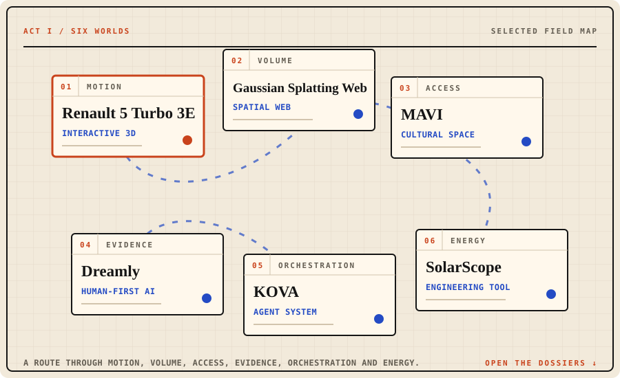
</picture>

The map is not a ranking. It is a route through six different ways of making a system understandable: movement, volume, access, evidence, orchestration and energy.

<strong>01 / MOTION — Renault 5 Turbo 3E</strong> · open dossier

 

<picture>
  <source media="(prefers-color-scheme: dark)" srcset="./assets/generated/world-01-dark.svg">
  <source media="(prefers-color-scheme: light)" srcset="./assets/generated/world-01-light.svg">
  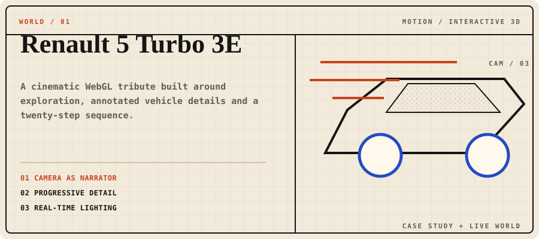
</picture>

### A vehicle scene with a point of view

A cinematic WebGL tribute built around exploration, annotated vehicle details and a twenty-step sequence. The camera acts as narrator: it controls pace, reveals context and turns inspection into a spatial story.

**What you can do:** move through a real-time vehicle scene, shift viewpoints and uncover details through a guided sequence.

**Built around:** camera as narrator · progressive detail · real-time lighting.

[Read the case study](https://github.com/RaulJuliosIglesias/renault-5-webgl-case-study) · [Enter the live world](https://showroomcar-alpha.vercel.app/)

> **Fan-made study.** Not affiliated with, endorsed by or sponsored by Renault or Renault Group.

<strong>02 / VOLUME — Gaussian Splatting Web</strong> · open dossier

 

<picture>
  <source media="(prefers-color-scheme: dark)" srcset="./assets/generated/world-02-dark.svg">
  <source media="(prefers-color-scheme: light)" srcset="./assets/generated/world-02-light.svg">
  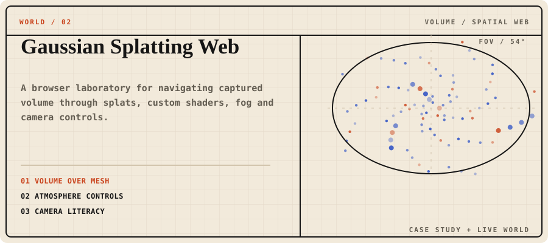
</picture>

### When a point field becomes a place

A browser laboratory for navigating captured volume through splats, custom shaders, fog and camera controls. It treats atmosphere and field of view as tools for reading space, not as decorative settings.

**What you can do:** orbit a spatial capture, alter field of view and atmosphere, and study how a volumetric scene changes under different viewing conditions.

**Built around:** volume over mesh · atmosphere controls · camera literacy.

[Read the case study](https://github.com/RaulJuliosIglesias/gaussian-splatting-web-case-study) · [Explore the live scene](https://web-gaussian-splatting-raul-iglesias.vercel.app/)

<strong>03 / ACCESS — MAVI</strong> · open dossier

 

<picture>
  <source media="(prefers-color-scheme: dark)" srcset="./assets/generated/world-03-dark.svg">
  <source media="(prefers-color-scheme: light)" srcset="./assets/generated/world-03-light.svg">
  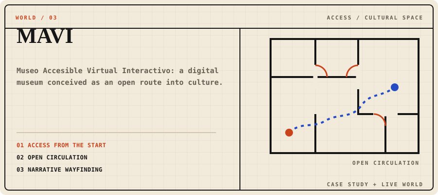
</picture>

### Culture as an open route

*Museo Accesible Virtual Interactivo* is a digital museum conceived around access, circulation and narrative wayfinding. It asks what a museum can become when the interface is part of the curatorial space.

**What you can do:** enter a virtual museum, follow a spatial story and encounter cultural material through an accessible interface.

**Built around:** access from the start · open circulation · narrative wayfinding.

[Read the case study](https://github.com/RaulJuliosIglesias/mavi-virtual-museum-case-study) · [Visit MAVI](https://www.mavii.eu/landing_page.html)

<strong>04 / EVIDENCE — Dreamly</strong> · open dossier

 

<picture>
  <source media="(prefers-color-scheme: dark)" srcset="./assets/generated/world-04-dark.svg">
  <source media="(prefers-color-scheme: light)" srcset="./assets/generated/world-04-light.svg">
  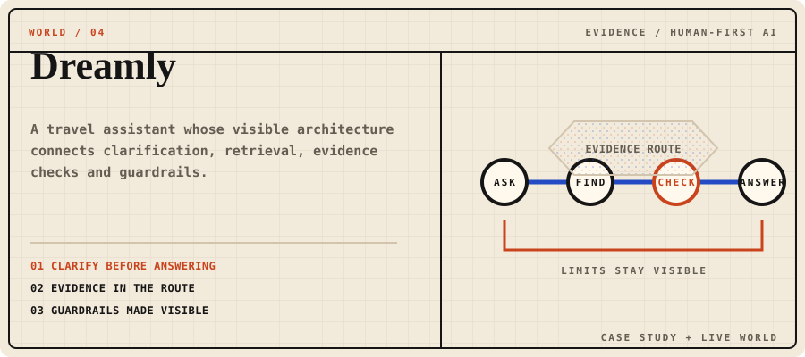
</picture>

### Intelligence with a visible route

A travel assistant whose architecture connects clarification, retrieval, evidence checks and guardrails. The useful part is not simply the answer; it is being able to understand how the system reached it and where its limits remain.

**What you can do:** trace how a request becomes a grounded response instead of treating intelligence as an unexplained black box.

**Built around:** clarify before answering · evidence in the route · guardrails made visible.

[Read the case study](https://github.com/RaulJuliosIglesias/dreamly-rag-case-study) · [Inspect the live architecture](https://dreamly-delta.vercel.app/architecture)

<strong>05 / ORCHESTRATION — KOVA</strong> · open dossier

 

<picture>
  <source media="(prefers-color-scheme: dark)" srcset="./assets/generated/world-05-dark.svg">
  <source media="(prefers-color-scheme: light)" srcset="./assets/generated/world-05-light.svg">
  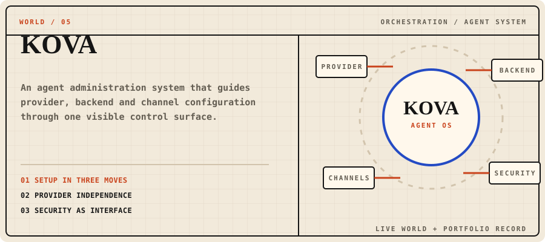
</picture>

### An agent system you can inspect

KOVA is an administration surface for configuring a model provider, agent backend and communication channels. Deployment and security are shown as parts of the product rather than hidden setup work.

**What you can do:** choose a provider, connect a backend and inspect Telegram, WhatsApp and Discord paths alongside the security pipeline.

**Built around:** setup in three moves · provider independence · security as interface.

[Open KOVA](https://kova-rosy.vercel.app/) · [Read the portfolio record](https://rauliglesiasjulios.com/en/projects/kova)

*The implementation repository is private; these links point only to the deployed experience and its public portfolio record.*

<strong>06 / ENERGY — SolarScope</strong> · open dossier

 

<picture>
  <source media="(prefers-color-scheme: dark)" srcset="./assets/generated/world-06-dark.svg">
  <source media="(prefers-color-scheme: light)" srcset="./assets/generated/world-06-light.svg">
  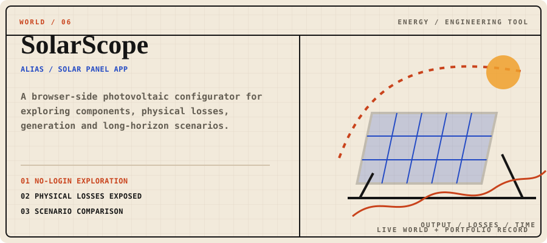
</picture>

### Engineering as a legible scenario

SolarScope—also catalogued as Solar Panel App—is a browser-side photovoltaic configurator for exploring components, physical losses, generation and long-horizon scenarios for homes in Spain.

**What you can do:** shape a residential installation, compare assumptions and read the engineering consequences as a connected system.

**Built around:** no-login exploration · physical losses exposed · scenario comparison.

[Open SolarScope](https://solar-panel-app-ruddy.vercel.app/) · [Read the portfolio record](https://rauliglesiasjulios.com/en/projects/solar-panel-app)

*The implementation repository is private; these links point only to the deployed experience and its public portfolio record.*

## Act II — How the Worlds Are Made

<picture>
  <source media="(prefers-color-scheme: dark) and (max-width: 520px)" srcset="./assets/generated/method-mobile-dark.svg">
  <source media="(max-width: 520px)" srcset="./assets/generated/method-mobile-light.svg">
  <source media="(prefers-color-scheme: dark)" srcset="./assets/generated/method-dark.svg">
  <source media="(prefers-color-scheme: light)" srcset="./assets/generated/method-light.svg">
  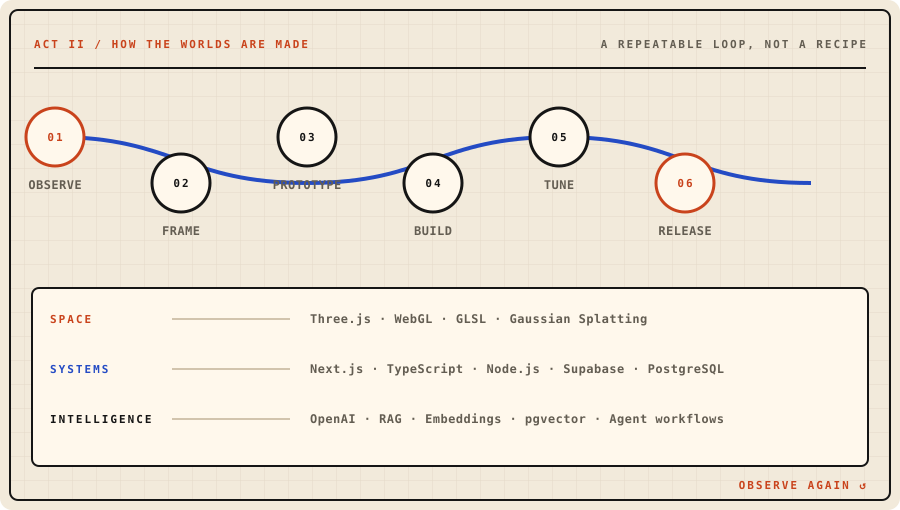
</picture>

`OBSERVE → FRAME → PROTOTYPE → BUILD → TUNE → RELEASE → OBSERVE AGAIN`

- **Keep the human in the loop.** Judgment, context and responsibility remain visible.
- **Make complexity visible.** Architecture should help someone understand the system they are using.
- **Let interaction earn its place.** Motion, depth and intelligence need a reason to be there.

The loop crosses three working territories: **Space** (`Three.js · WebGL · GLSL · Gaussian Splatting`), **Systems** (`Next.js · TypeScript · Node.js · Supabase · PostgreSQL`) and **Intelligence** (`OpenAI · RAG · embeddings · pgvector · agent workflows`).

## Act III — Field Notes

<picture>
  <source media="(prefers-color-scheme: dark)" srcset="./assets/generated/field-note-01-dark.svg">
  <source media="(prefers-color-scheme: light)" srcset="./assets/generated/field-note-01-light.svg">
  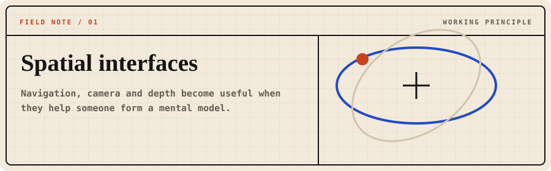
</picture>

**Spatial interfaces.** Navigation, camera and depth become useful when they help someone form a mental model.

<picture>
  <source media="(prefers-color-scheme: dark)" srcset="./assets/generated/field-note-02-dark.svg">
  <source media="(prefers-color-scheme: light)" srcset="./assets/generated/field-note-02-light.svg">
  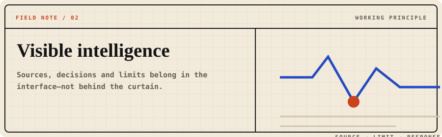
</picture>

**Visible intelligence.** Sources, decisions and limits belong in the interface—not behind the curtain.

<picture>
  <source media="(prefers-color-scheme: dark)" srcset="./assets/generated/field-note-03-dark.svg">
  <source media="(prefers-color-scheme: light)" srcset="./assets/generated/field-note-03-light.svg">
  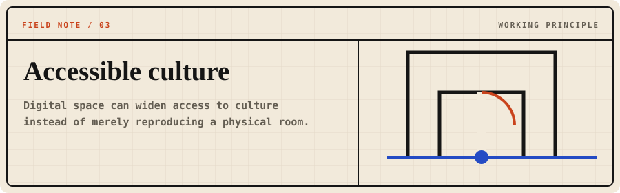
</picture>

**Accessible culture.** Digital space can widen access to culture instead of merely reproducing a physical room.

## Appendix — Inventory and Marginalia

<strong>Open inventory</strong> · tools grouped by what they help make

### Worldmaking

`Three.js` · `WebGL` · `GLSL` · `GSAP` · `Gaussian Splatting` · `Blender`

### Systems

`Next.js` · `React` · `TypeScript` · `Node.js` · `Supabase` · `PostgreSQL` · `REST APIs`

### Intelligence

`OpenAI` · `RAG` · `Embeddings` · `pgvector` · `Agent workflows` · `n8n` · `Python`

### Practice

`Accessibility` · `Performance` · `Prototyping` · `Observation` · `Maintainability`

<strong>Appendix 00</strong> · open only if curious

I like prototypes because they are honest: they reveal what an idea can do, where it resists and what still needs to be learned.

The craft lives between disciplines—part engineering, part visual language, part observation. The goal is not to remove uncertainty. It is to give people better instruments for moving through it.

### End matter

[Portfolio](https://rauliglesiasjulios.com) · [LinkedIn](https://www.linkedin.com/in/rauliglesiasjulios)

*Construyo tecnología para ampliar la imaginación humana.*
