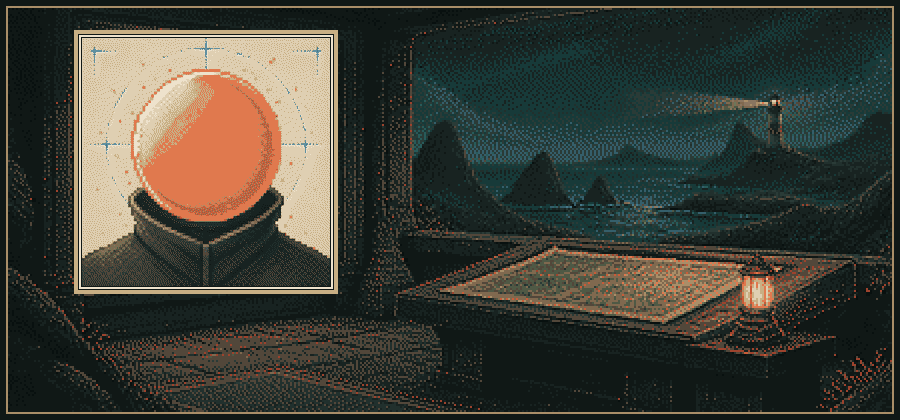
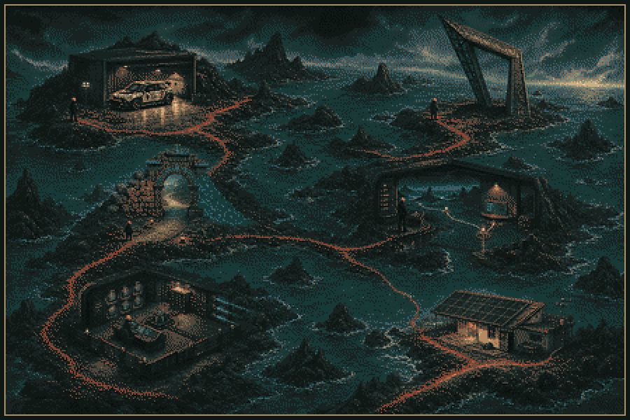
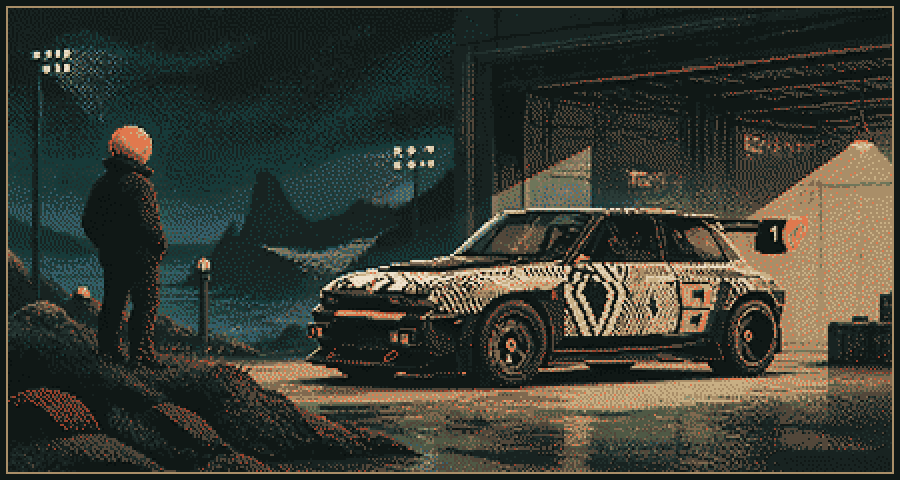
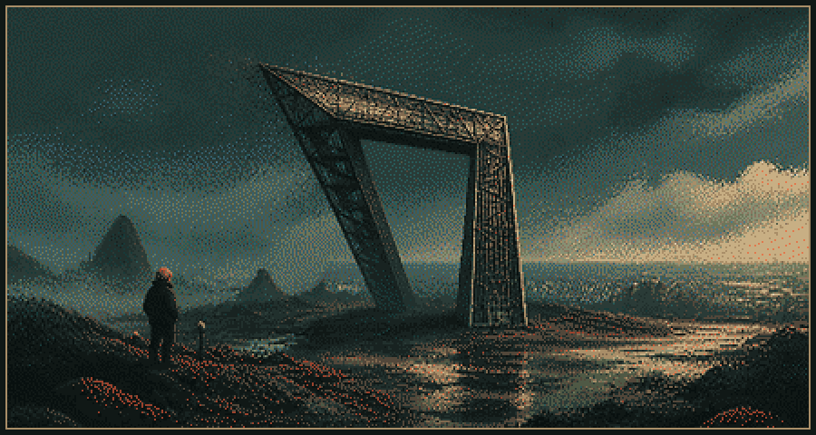
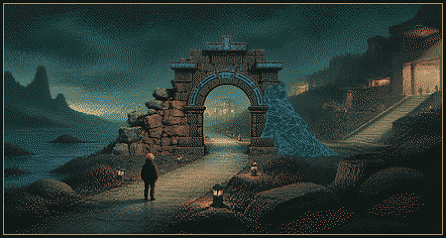
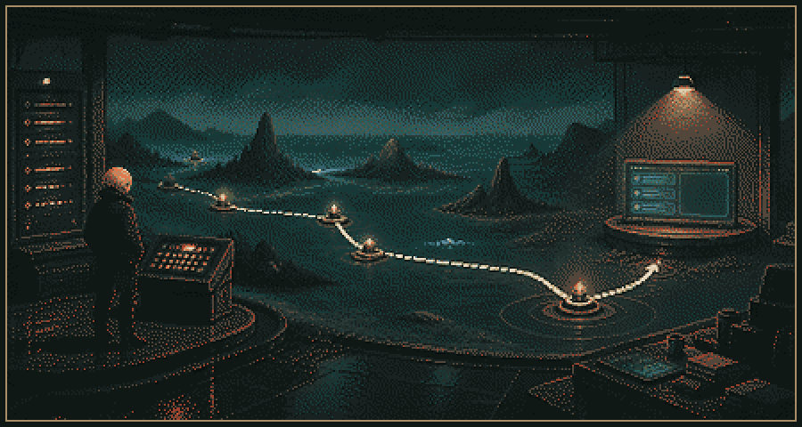
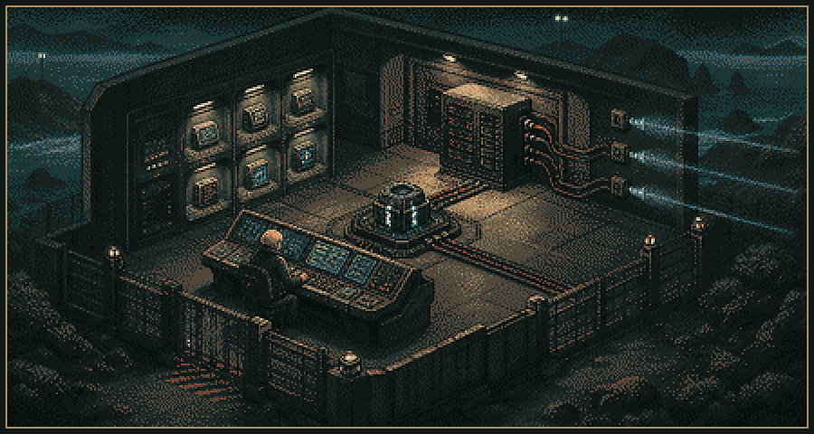
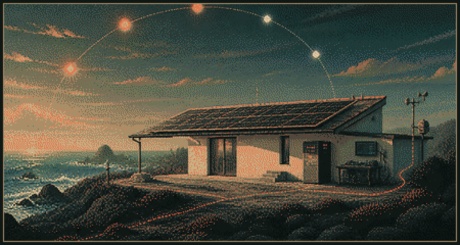
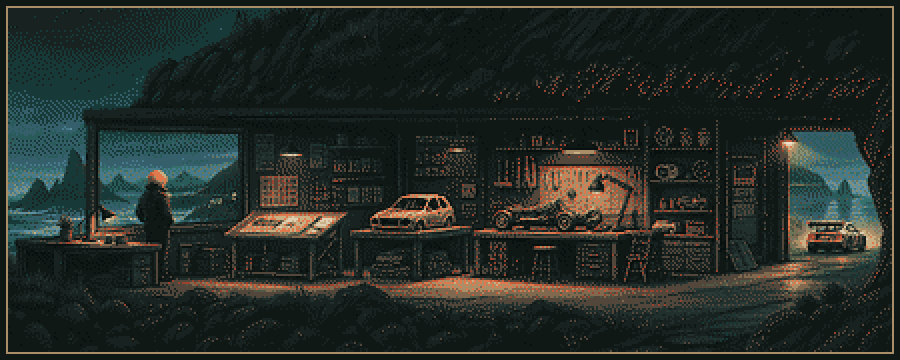

<picture>
  <source media="(max-width: 520px)" srcset="./assets/artbook-v3/hero-mobile.png">
  
</picture>

ATLANTIC PIXEL ARTBOOK · VOL. III / ATLANTIC NODE

# Raúl Iglesias Julios

**Creative technologist · world builder**

I build digital worlds where intelligence, space and story become useful tools.

The work moves between browser-native 3D, human-first AI, cultural access and small systems that make complexity legible.

> **Current thread:** turn complex systems into places people can understand.

[`ENTER THE ATLAS`](#act-i--six-worlds) · [`VISIT THE WORKSHOP`](#act-ii--the-workshop) · [`OPEN THE APPENDIX`](#appendix--inventory-and-marginalia)

## Act I — Six Worlds

<picture>
  <source media="(max-width: 520px)" srcset="./assets/artbook-v3/atlas-mobile.png">
  
</picture>

The route moves through six kinds of legibility: **motion, volume, access, evidence, orchestration and energy.**

<strong>01 · MOTION / INTERACTIVE 3D</strong> — Renault 5 Turbo 3E

 

<picture>
  <source media="(prefers-reduced-motion: no-preference)" srcset="./assets/artbook-v3/worlds/renault-5-turbo-3e.webp" type="image/webp">
  
</picture>

### Camera as narrator

A cinematic WebGL tribute built around a real-time vehicle scene, annotated details and a twenty-step sequence. The camera controls pace: each viewpoint turns inspection into part of the story.

**In the world:** move through the scene, shift viewpoints and uncover details along a guided spatial route.

`CAMERA AS NARRATOR` · `PROGRESSIVE DETAIL` · `REAL-TIME LIGHTING`

[Read the case study](https://github.com/RaulJuliosIglesias/renault-5-webgl-case-study) · [Enter the live experience](https://showroomcar-alpha.vercel.app/)

> **Fan-made study.** Not affiliated with, endorsed by or sponsored by Renault or Renault Group.

<strong>02 · VOLUME / SPATIAL WEB</strong> — Gaussian Splatting Web

 

<picture>
  <source media="(prefers-reduced-motion: no-preference)" srcset="./assets/artbook-v3/worlds/gaussian-splatting-web.webp" type="image/webp">
  
</picture>

### When a point field becomes a place

A browser experiment for navigating captured volume through Gaussian splats, fog and camera controls. Atmosphere and field of view become instruments for reading depth.

**In the world:** orbit the capture, move through the scene, change field of view and tune the fog.

`VOLUME OVER MESH` · `ATMOSPHERE CONTROLS` · `CAMERA LITERACY`

[Read the case study](https://github.com/RaulJuliosIglesias/gaussian-splatting-web-case-study) · [Explore the live scene](https://web-gaussian-splatting-raul-iglesias.vercel.app/)

<strong>03 · ACCESS / CULTURAL SPACE</strong> — MAVI

 

<picture>
  <source media="(prefers-reduced-motion: no-preference)" srcset="./assets/artbook-v3/worlds/mavi.webp" type="image/webp">
  
</picture>

### Culture as an open route

*Museo Accesible Virtual Interactivo* explores a Canarian museum as a navigable digital space. Architecture, points of interest and interface tools form one continuous route.

**In the world:** cross the portal, follow the museum path and encounter cultural material through its spatial viewer.

`ACCESS FROM THE START` · `OPEN CIRCULATION` · `NARRATIVE WAYFINDING`

[Read the case study](https://github.com/RaulJuliosIglesias/mavi-virtual-museum-case-study) · [Visit MAVI](https://www.mavii.eu/landing_page.html)

<strong>04 · EVIDENCE / HUMAN-FIRST AI</strong> — Dreamly

 

<picture>
  <source media="(prefers-reduced-motion: no-preference)" srcset="./assets/artbook-v3/worlds/dreamly.webp" type="image/webp">
  
</picture>

### Intelligence with a visible route

A travel assistant architecture that connects clarification, retrieval, evidence and guardrails. The route to an answer remains inspectable instead of disappearing behind the interface.

**In the world:** follow a request from question to retrieval, evidence checks and the final grounded response.

`CLARIFY FIRST` · `EVIDENCE IN THE ROUTE` · `VISIBLE GUARDRAILS`

[Read the case study](https://github.com/RaulJuliosIglesias/dreamly-rag-case-study) · [Inspect the live architecture](https://dreamly-delta.vercel.app/architecture)

<strong>05 · ORCHESTRATION / AGENT SYSTEM</strong> — KOVA

 

<picture>
  <source media="(prefers-reduced-motion: no-preference)" srcset="./assets/artbook-v3/worlds/kova.webp" type="image/webp">
  
</picture>

### The system behind the agent

KOVA is an administration surface for configuring a model provider, an agent backend and communication channels. Setup and security are treated as visible parts of the system.

**In the world:** choose a provider, connect the backend and inspect the routes into supported channels.

`THREE-PART SETUP` · `PROVIDER CHOICE` · `SECURITY AS INTERFACE`

[Open KOVA](https://kova-rosy.vercel.app/) · [Read the public project record](https://rauliglesiasjulios.com/en/projects/kova)

*Public evidence is limited to the deployed experience and portfolio record; the implementation repository is private.*

<strong>06 · ENERGY / ENGINEERING TOOL</strong> — SolarScope

 

<picture>
  <source media="(prefers-reduced-motion: no-preference)" srcset="./assets/artbook-v3/worlds/solarscope.webp" type="image/webp">
  
</picture>

### Engineering as a legible scenario

SolarScope—also catalogued as *Solar Panel App*—is a browser-side photovoltaic configurator for exploring components, physical losses, generation and long-horizon scenarios.

**In the world:** shape a residential solar setup, compare assumptions and read their engineering consequences as one connected system.

`EXPLORATION FIRST` · `PHYSICAL LOSSES EXPOSED` · `SCENARIO COMPARISON`

[Open SolarScope](https://solar-panel-app-ruddy.vercel.app/) · [Read the public project record](https://rauliglesiasjulios.com/en/projects/solar-panel-app)

*Public evidence is limited to the deployed experience and portfolio record; the implementation repository is private.*

## Act II — The Workshop

<picture>
  
</picture>

`OBSERVE` → `FRAME` → `PROTOTYPE` → `BUILD` → `TUNE` → `RELEASE` → `OBSERVE AGAIN`

The same loop crosses three working territories:

- **Space** — Three.js, WebGL, GLSL and Gaussian Splatting.
- **Systems** — Next.js, TypeScript, Node.js, Supabase and PostgreSQL.
- **Intelligence** — OpenAI, RAG, embeddings, pgvector and agent workflows.

Three rules stay on the workbench:

- Keep the human in the loop.
- Make complexity visible.
- Let interaction earn its place.

### Field notes

**01 / Spatial interfaces.** Navigation, camera and depth become useful when they help someone form a mental model.

**02 / Visible intelligence.** Sources, decisions and limits belong in the interface—not behind the curtain.

**03 / Accessible culture.** Digital space can widen access to culture instead of merely reproducing a physical room.

## Appendix — Inventory and Marginalia

<strong>Field inventory</strong> — tools grouped by what they help make

### Worldmaking

`Three.js` · `WebGL` · `GLSL` · `GSAP` · `Gaussian Splatting` · `Blender`

### Systems

`Next.js` · `React` · `TypeScript` · `Node.js` · `Supabase` · `PostgreSQL` · `REST APIs`

### Intelligence

`OpenAI` · `RAG` · `Embeddings` · `pgvector` · `Agent workflows` · `n8n` · `Python`

### Practice

`Accessibility` · `Performance` · `Prototyping` · `Observation` · `Maintainability`

<strong>Appendix 00</strong> — open only if curious

I keep returning to prototypes because they make an idea answerable. They reveal what works, what resists and what still needs to be learned.

The craft sits between disciplines: part engineering, part visual language, part observation. I am interested in tools that do more than perform a task—tools that leave people with a clearer map of the thing they just used.

### End matter

[Portfolio](https://rauliglesiasjulios.com) · [LinkedIn](https://www.linkedin.com/in/rauliglesiasjulios)

*Construyo tecnología para ampliar la imaginación humana.*
