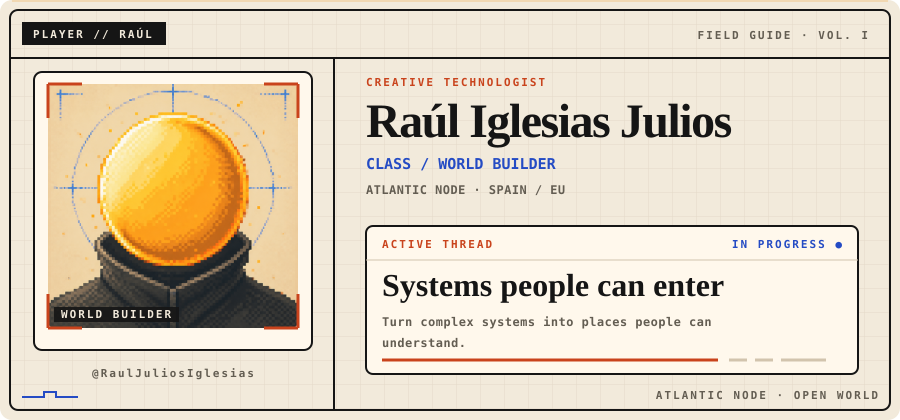

<picture>
  <source media="(prefers-color-scheme: dark)" srcset="./assets/generated/hero-dark.svg">
  <source media="(prefers-color-scheme: light)" srcset="./assets/generated/hero-light.svg">
  
</picture>

## Art, systems and useful experiments

I build **human-first AI**, **interactive 3D** and digital experiences that invite people to explore rather than merely consume.

Technology is most interesting to me when it behaves like an instrument: extending judgment, imagination and access without removing the human from the loop.

### Current quest

> **Make useful systems feel alive.** Combine strong engineering with spatial interaction, clear narrative and just enough play.

## Quest log

### `01` — Renault 5 Turbo 3E

**Interactive 3D · fan-made tribute** — A cinematic WebGL homage built around exploration, annotated vehicle details and a twenty-step sequence.

[Case study](https://github.com/RaulJuliosIglesias/renault-5-webgl-case-study) · [Enter the experience](https://showroomcar-alpha.vercel.app/)

### `02` — Gaussian Splatting Web

**Spatial experiment · shaders** — A browser playground for navigating splats, changing fields of view and experimenting with fog and animation.

[Case study](https://github.com/RaulJuliosIglesias/gaussian-splatting-web-case-study) · [Explore the scene](https://web-gaussian-splatting-raul-iglesias.vercel.app/)

### `03` — Dreamly

**Human-first AI · RAG** — A travel assistant whose visible architecture connects clarification, retrieval, evidence checks and guardrails.

[Case study](https://github.com/RaulJuliosIglesias/dreamly-rag-case-study) · [Inspect the architecture](https://dreamly-delta.vercel.app/architecture)

### `04` — MAVI

**Accessible culture · virtual museum** — *Museo Accesible Virtual Interactivo*: a digital museum experience designed around access to culture.

[Case study](https://github.com/RaulJuliosIglesias/mavi-virtual-museum-case-study) · [Visit MAVI](https://www.mavii.eu/landing_page.html)

## Skill tree

| Branch | Working knowledge |
| --- | --- |
| **World Building** | Three.js · WebGL · GSAP · 3D capture · Spatial UX |
| **Systems** | Next.js · TypeScript · Node.js · Supabase · PostgreSQL |
| **Intelligence** | OpenAI · RAG · Embeddings · Vector search · Agent workflows |

<strong>Open inventory</strong> — additional tools and ways of working

 

`React` · `Python` · `REST APIs` · `n8n` · `LangChain` · `pgvector` · `Firebase` · `Blender` · `Figma`

I work from idea → architecture → prototype → deployment → observation. Accessibility, performance and maintainability stay part of the design rather than becoming a final checklist.

---

[Portfolio](https://rauliglesiasjulios.com) · [LinkedIn](https://www.linkedin.com/in/rauliglesiasjulios) · [Support future experiments](https://buymeacoffee.com/rauliglesias)

*Construyo tecnología para ampliar la imaginación humana.*

