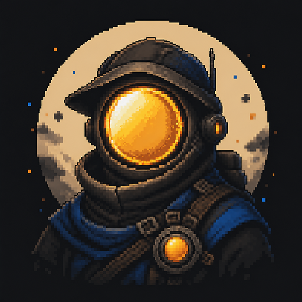
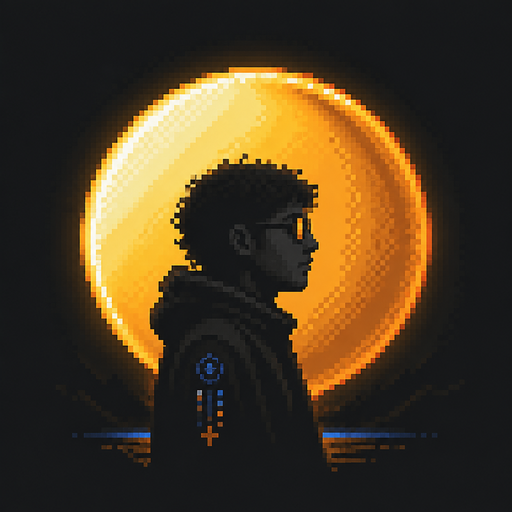
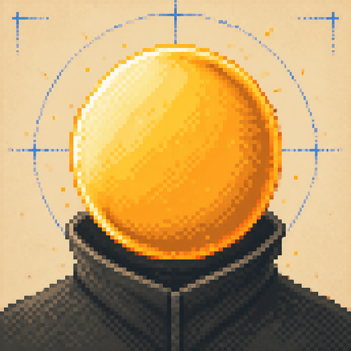

# Avatar studies

Three 512 × 512 pixel-art directions derived from the existing orange-orb identity:

| World Builder | Orbit portrait | Orb mask |
| --- | --- | --- |
|  |  |  |
| More narrative | More human | Most minimal |

The profile HUD currently previews **Orb mask**. Changing the global GitHub avatar should happen only after the preferred variant is chosen.

